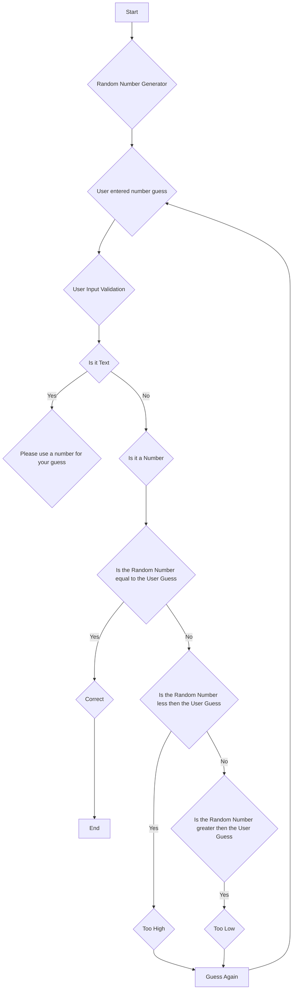

# guessinggame.github.io

```mermaid

flowchart TD
    A[Start] --> B{Random Number Generator} --> C{User entered number guess} -->D{User Input Validation} --> E{Is it Text}
    E -- Yes --> O{Please use a number for your guess}
    E -- No --> F{Is it a Number}
    F --> G{Is the Random Number equal to the User Guess}
    G -- Yes -->  H{Correct}
    G -- No --> I{Is the Random Number less then the User Guess}
    I -- Yes --> J{Too High}
    I -- No --> K{Is the Random Number greater then the User Guess}
    K -- Yes --> L{Too Low}
    J & L --> M[Guess Again]
    M --> C
    H --> N[End]
```