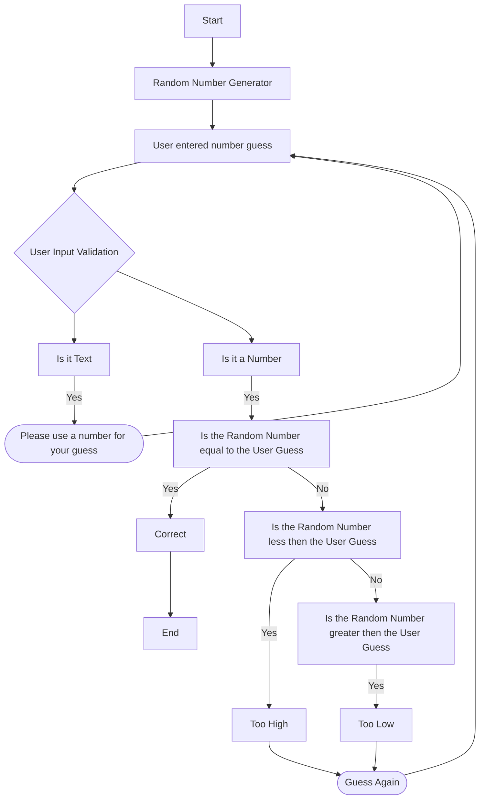

# guessinggame.github.io

```mermaid

flowchart TD
    A[Start] --> B[Random Number Generator] --> C[User entered number guess] -->D{User Input Validation} --> E[Is it Text] & F[Is it a Number]
    E -- Yes --> G([Please use a number for your guess])
    G --> C
    F -- Yes --> H[Is the Random Number equal to the User Guess]
    H -- Yes -->  I[Correct]
    H -- No --> J[Is the Random Number less then the User Guess]
    J -- Yes --> K[Too High]
    J -- No --> L[Is the Random Number greater then the User Guess]
    L -- Yes --> M[Too Low]
    K & M --> N([Guess Again])
    N --> C
    I --> O[End]
```